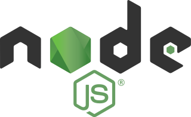



# BlogNet: A SEO friendly blog made with NodeJS, ReactJS , NextJS and MongoDB

Hi! ***BlogNet*** is a Multi User SEO friendly blogging website built with Next.js + MERN stack. It allows the user to register (which would send you a register link) as a new user. As a registered user, you can do the normal CRUD of your blogs if you do decide to publish. You can login as *"normal user"* or as *"admin user"*. It also has the functionality for password reset/recover.

## Frontend
| 🥇 | 🥈 | 
| :---:         |     :---:      |
| [**Next.js**  ](https://github.com/centipede13/BlogNet-NextJS-SEOblog)|[**React.js**  ](https://github.com/centipede13/BlogNet-NextJS-SEOblog)

## Backend
 [**Node / Express**  ](https://github.com/centipede13/BlogNet-NextJS-SEOblog)

## Implemented

### Backend

 - [x] Node Api Setup
 - [x] User SignUp/SignIn Api
 - [x] Protected Route based on Role/Pofile (i.e. Admin/User ) with  Dashboard Link
 - [x] Categories & Tag Api
 - [x] Blog Api
 - [x] Related Blogs Api
 - [x] Admin Blog update/delete Api
 - [x] Categories Tags Seo Update
 - [x] Blog Search Api
 - [x] User Public Profile Updated
 - [x] Token Expiry and Discussion/comments 
 - [x] Contact Form Api
 - [x] Password forgot/reset
 - [x] Account Activation by Mail
 - [x] Google Social login

### Frontend

 - [x] Frontend Setup
 - [x] Basic Layout
 - [x] SignUp/SignIn
 - [x] Admin/user dashboards
 - [x] Categories & Tag Pages
 - [x] Blog Page
 - [x] Related Blogs Component
 - [x] Admin Blog update/delete
 - [x] Blog Search
 - [x] User Public Profile Updated
 - [x] Discussion/comments frontend
 - [x] Contact Form frontend
 - [x] pasword reset
 - [x] Account Activation by Mail
 - [x] Google Social login

### ToDO:
 - [ ] Improve look and feel of blog

## Author
👤 **Aryan Pandey**
* Github: [@centipede13](https://github.com/centipede13)

## Show your support

Give a ⭐️ if this project helped you!

# License
All of the codebases are **MIT licensed** unless otherwise specified.

 

